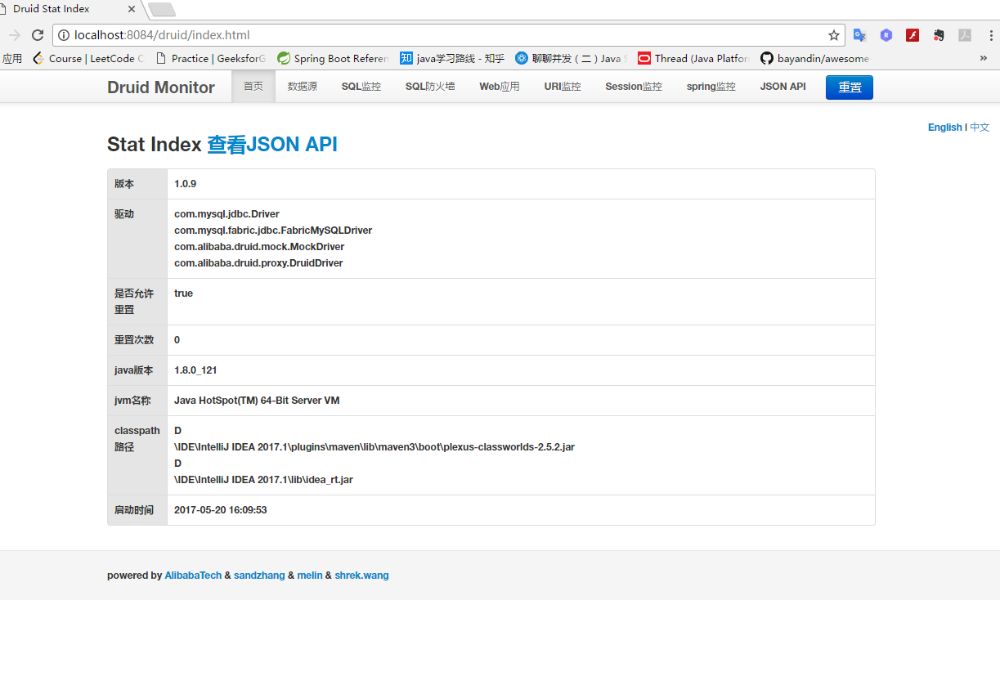

<h1>优雅的物联网架构</h1>
<p>技术选型:</p>

- [Netty](https://github.com/netty/netty)
- Maven
- Spring
- Mybatis(最少配置方案)
- Druid(数据源配置 sql防注入 sql性能监控)
- Google Protobuf解编码框架
- 持续更新中 @>+++++++<@
<hr/>
Netty基本功能实现：

```
(1)心跳检测
基本解释：客户端异常掉线，比如断开网线或者断电等情况下，客户端的channel对象不会自动关闭，所以才引入了心跳的机制，
也就是服务器端通过监测在心跳期间内（1分钟）是否收到了客户端发过来的消息，来判断是否可以和客户端进行通信，
如果没有收到任何消息，则视为客户端掉线。心跳机制就是为了解决你说的这个问题的。不光是netty，所有基于socket的通信都有这个问题，
因为客户端和服务端是基于消息的协议，只有客户端主动发出断开的消息给服务端，服务端才能明确知道客户端断开了连接，
直接拔掉网线或者断电的情况下，属于底层的异常，客户端程序是根本监测不到的，即使你的客户端程序能够监测到，也没有用，
因为此时网线已经被拔掉了，根本没法给服务端发送消息。所以服务端才引入了心跳机制来对应这种异常情况，相当于超时机制，
超过规定时间没有接到消息，就视为客户端掉线了，以释放服务端的资源。
```

Google的[Protobuf](https://github.com/google/protobuf)在业界非常流行

```
(1)在谷歌内部长期使用，产品成熟度高;
(2)跨语言 支持多种语言，包括C++,Java和Python;
(3)编码后的消息更小，更加有利于存储和传输;
(4)编解码的性能非常高;
(5)支持不同协议的前向兼容;
(6)支持定义可选和必选字段。
```

<hr />

[Druid](https://github.com/alibaba/druid)号称是Java语言中最好的数据库连接池
```
1 可以监控数据库访问性能，Druid内置提供了一个功能强大的StatFilter插件，能够详细统计SQL的执行性能，这对于线上分析数据库
访问性能有帮助。
2 替换DBCP和C3P0。Druid提供了一个高效，功能强大，可扩展性好的数据库连接池。
3 数据库密码加密。直接把数据库密码写在配置文件中，这是不好的行为，容易导致安全问题。DruidDruiver和DruidDataSource都支持
PasswordCallback。
4 SQL执行日志，Druid提供了不同的LogFilter,能够支持Common-Logging,Log4j和JdkLog，你可以按需要选择相应的LogFilter，监控
你应用的数据库访问情况。
5 能够提供基于Filter - Chain模式的插件体系
```
下面介绍下如何在项目中集成Druid:
<br/>
1. maven依赖
```
<dependency>
            <groupId>com.alibaba</groupId>
            <artifactId>druid</artifactId>
            <version>${druid.version}</version>
</dependency>
```
2. 配置web.xml
```
<!-- druid -->  
<servlet>  
    <servlet-name>DruidStatView</servlet-name>  
    <servlet-class>com.alibaba.druid.support.http.StatViewServlet</servlet-class>  
</servlet>  
<servlet-mapping>  
    <servlet-name>DruidStatView</servlet-name>  
    <url-pattern>/druid/*</url-pattern>  
</servlet-mapping>  
  
<filter>  
    <filter-name>DruidWebStatFilter</filter-name>  
    <filter-class>com.alibaba.druid.support.http.WebStatFilter</filter-class>  
    <init-param>  
        <param-name>exclusions</param-name>  
        <param-value>*.js,*.gif,*.jpg,*.png,*.css,*.ico,/druid/*</param-value>  
    </init-param>  
</filter>  
<filter-mapping>  
    <filter-name>DruidWebStatFilter</filter-name>  
    <url-pattern>/*</url-pattern>  
</filter-mapping>  
```

3. spring.xml中配置druid数据源
```
<!-- 数据源druid -->  
<bean id="dataSource" class="com.alibaba.druid.pool.DruidDataSource"   
init-method="init" destroy-method="close">  
    <property name="driverClassName" value="${jdbc.driverClassName}" />  
    <property name="url" value="${jdbc.url}" />  
    <property name="username" value="${jdbc.username}" />  
    <property name="password" value="${jdbc.password}" />  
      
     <!-- 配置初始化大小、最小、最大 -->    
    <property name="initialSize" value="${druid.pool.size.init}" />    
    <property name="minIdle" value="${druid.pool.size.min}" />     
    <property name="maxActive" value="${druid.pool.size.max}" />    
      
    <!-- 配置监控统计拦截的filters，去掉后监控界面sql无法统计 -->  
    <property name="filters" value="stat" />   
</bean>  
```
**添加之后的效果如下：**<br/>

<hr />